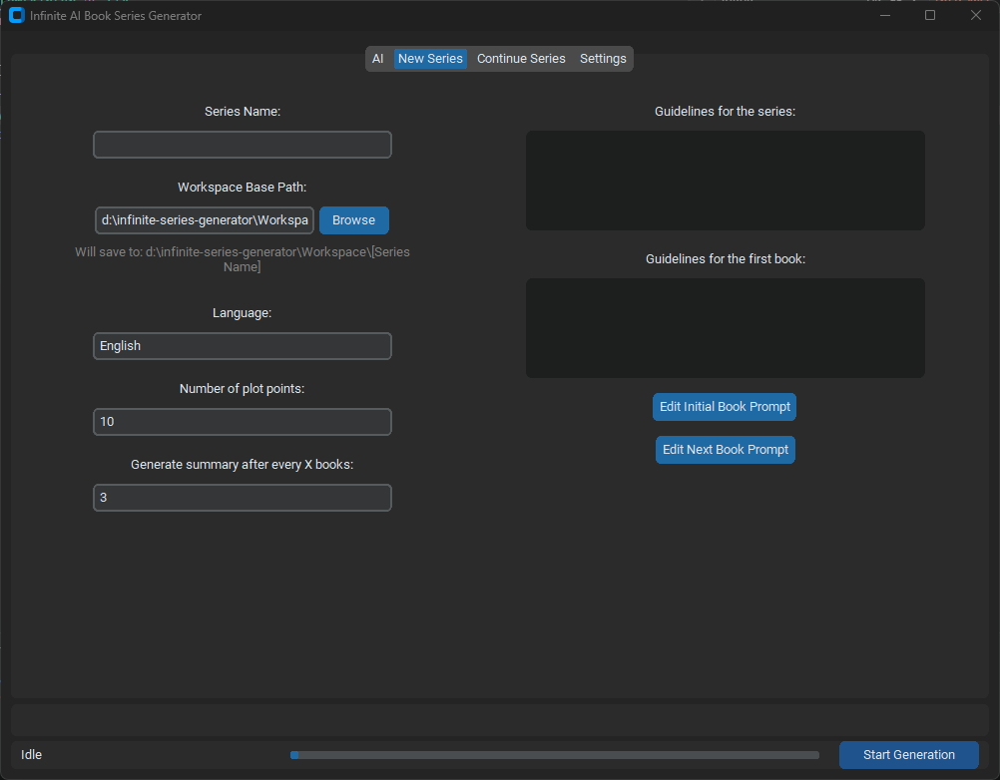

# Infinite AI Book Series Generator


A desktop app for generating long-running AI-powered book series with a simple GUI.

It lets you configure an AI provider, start a new series, continue an existing one, edit prompt files, and automatically save generated books, summaries, and intermediate JSON data to a workspace folder.

## Features

- Generate multi-book series from a persistent project state
- Start a brand new series or continue an existing one
- Cloud providers: OpenAI, Anthropic, and Google
- Local mode for compatible endpoints such as LM Studio
- Editable prompt files for:
  - initial book setup
  - next book continuation
  - part writing
  - summary generation
- Automatic PDF export for books and summaries
- Auto-saved series state, so generation can be resumed later
- API keys stored through the system keyring instead of plain text config files

## How it works

When you create a new series, the app creates a dedicated folder inside your workspace. Each series keeps its own state, generated book files, summaries, and JSON data.

Generation works in stages:

1. Create an outline for the current book
2. Generate each part of the book step by step
3. Merge the generated text into a PDF
4. Save raw text data as JSON
5. Periodically generate a summary for continuity between books
6. Move on to the next book automatically

This makes it possible to build very long-running series while preserving context between books.

## Requirements

You need one of the following:

- A cloud API key for OpenAI, Anthropic, or Google

or

- A local OpenAI-compatible endpoint such as LM Studio

## Installation

### Option 1: Download the release build (recommended)

You do **not** need to install Python to use the app.

1. Go to the project's **Releases** page
2. Download the latest `.zip` package
3. Extract the archive anywhere you want
4. Open the extracted folder
5. Run `infinite-ai-book-series-generator.exe`

The release package already includes the executable and the required app files, including the `prompts/` folder.

### Option 2: Run from source

Use this only if you want to modify the project or run the app directly from the source code.

```bash
git clone https://github.com/MichalKierz/Infinite-AI-Book-Series-Generator
cd infinite-ai-book-series-generator
pip install customtkinter openai anthropic google-genai fpdf2 keyring
python main.py
```

## Setup

### Cloud mode

1. Open the **AI** tab
2. Select **Cloud API**
3. Choose a provider
4. Enter:
   - model name
   - API key
   - any optional provider-specific settings you want to use
5. Click **Test Connection**

### Local mode

1. Open the **AI** tab
2. Select **Local AI**
3. Enter your local endpoint URL
4. Click **Test Connection**

## Creating a new series

1. Open the **New Series** tab
2. Enter the series name
3. Choose the workspace base path
4. Set the language
5. Set the number of plot points
6. Choose how often summaries should be generated
7. Fill in the series guidelines
8. Fill in the first-book guidelines
9. Click **Start Generation**

## Continuing a series

1. Open the **Continue Series** tab
2. Click **Select Series**
3. Choose the main folder of an existing series
4. Click **Continue Series** or **Resume Generation**

## Output

For each series, the app saves:

- **PDF books** in `novels/`
- **PDF summaries** in `summaries/`
- **Raw JSON text data** in `data/`
- **Series state** in `series_state.json`

## Configuration and secrets

- Non-sensitive app settings are stored in `app_config.json`
- API keys are stored through the system keyring
- Prompt text files live in the `prompts/` folder and can be edited from the GUI

# License

This project is licensed under the MIT License. See the `LICENSE` file for details.
